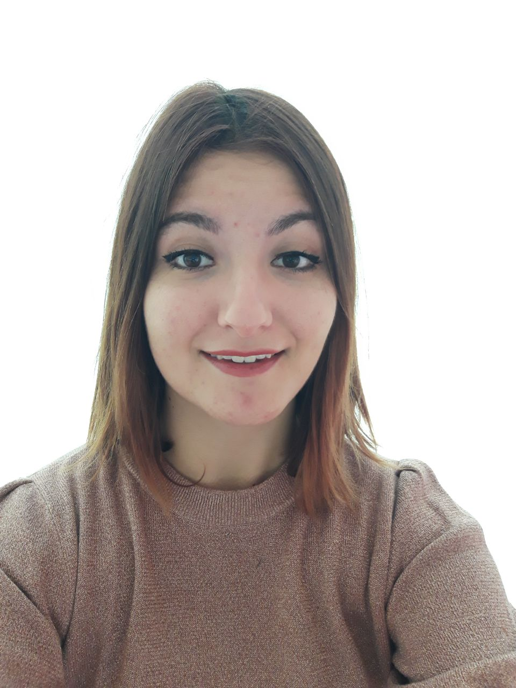
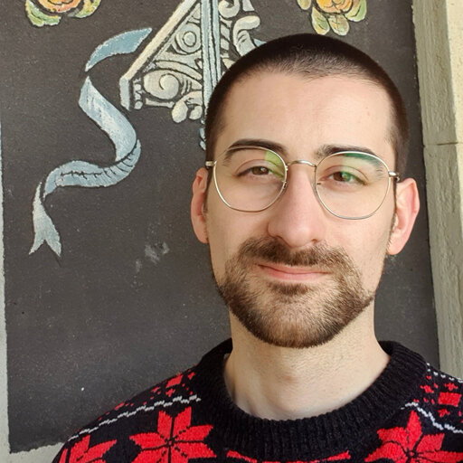
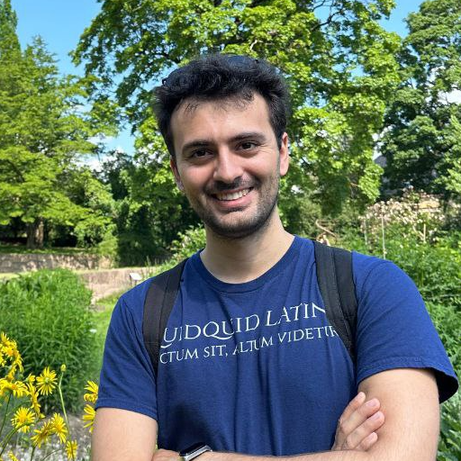
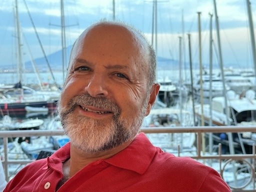

## Organizing Committee ##

<table>
    <col width="20%" />
    <col width="20%" />
    <col width="20%" />
    <col width="20%" />
    <col width="20%" />
    <tr>
        <td></td>
        <td></td>
        <td></td>
        <td></td>
        <td></td>
    </tr>
    <tr>
        <td> 
            <a href='https://sites.google.com/view/elenaumili/home'>Elena Umili</a>
            <a href='mailto:umili@diag.uniroma1.it'>📧</a>
        </td>
        <td> 
            <a href='https://scholar.google.com/citations?user=EezNcLIAAAAJ&hl=it'>Federico Sabbatini</a>
            <a href='mailto:f.sabbatini1@campus.uniurb.it'>📧</a>
        </td>
        <td> 
            <a href='https://www.unibo.it/sitoweb/giovanni.ciatto'>Giovanni Ciatto</a> 
            <a href='mailto:giovanni.ciatto@unibo.it'>📧</a>
        </td>
        <td> 
            <a href='https://www.unibo.it/sitoweb/matteo.magnini/en'>Matteo Magnini</a>
            <a href='mailto:matteo.magnini@unibo.it'>📧</a>
        </td>
        <td> 
            <a href='http://www.cse.yorku.ca/~lesperan/'>Yves Lesperance</a>
            <a href='mailto:lesperan@yorku.ca'>📧</a>
        </td>
    </tr>
    <tr>
        <td> TU Delft, The Netherlands </td>
        <td> TU Delft, The Netherlands </td>
        <td> University of Bologna, Italy </td>
        <td> TU Delft, The Netherlands </td>
        <td> KU Leuven, Belgium </td>
    </tr>
 </table>

## Keynote

TBD.

## Program Committee

- TBD
